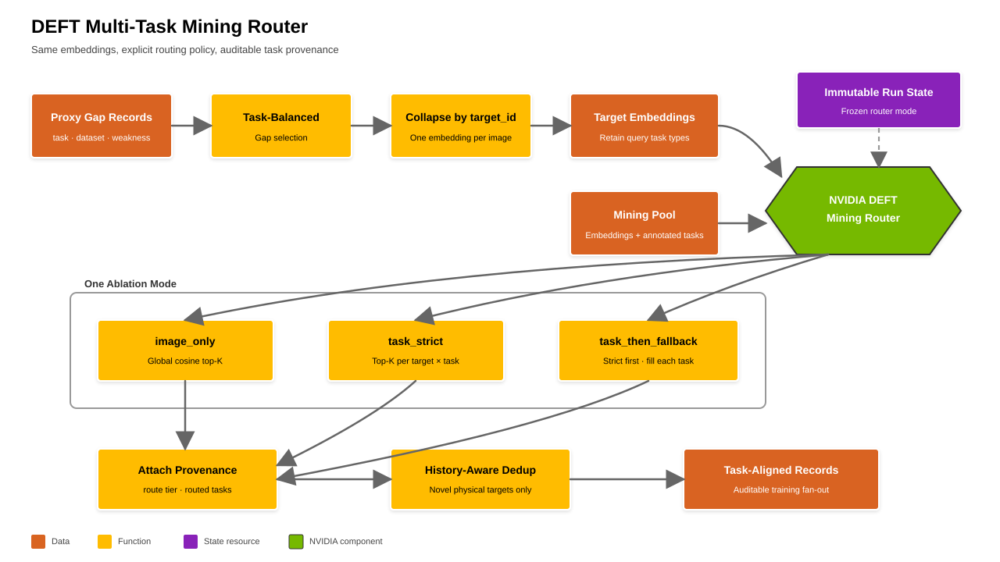

# Proxy RCCA and Benchmark KPI

Run `analyze_gaps.py` only after the matching evaluator job reaches
`COMPLETE`.

## Bare Proxy

```bash
"$PYTHON" "$SKILL_ROOT/scripts/analyze_gaps.py" \
  --results-json "$RESULTS_DIR/$LABEL/evaluate_proxy/results.json" \
  --output-dir "$RESULTS_DIR/$LABEL/proxy_rcca" \
  --evaluation-role proxy \
  --kpi-metric "$KPI_METRIC" \
  --kpi-threshold "$KPI_THRESHOLD"
```

Proxy writes:

- `gaps_summary.json`;
- `false_accepts.json` / `.csv`;
- `false_rejects.json` / `.csv`;
- `unknown_predictions.json`.

Before the `proxy_rcca` commit, write `RCCA_Report.md` in this same output
directory from `gaps_summary.json`, `false_accepts.json`, and
`false_rejects.json`, following `references/RCCA_REPORT_TEMPLATE.md`. The
commit requires `--rcca-report <absolute path to RCCA_Report.md>` and validates
all six section headings. Artifact classes, state fields, and required headings
come from `references/rcca-artifact-manifest.json`.

Only these Proxy artifacts may produce routing/mining targets. Proxy
`kpi.met` is intentionally null.

### Recovering image paths for routing

The evaluator's `results.json` carries only `video_id`, `response`, `question`,
and `gt`, so every gap row's `images` field is `null`. The gap artifacts alone
are therefore **not** enough to build `mining_targets.json` — routing must join
each row back to its source record by `id`.

Join against `annotations/proxy_kpi.json` **only**. Pulling a row from
Benchmark, or from a merged view of both, feeds Benchmark error signal into
mining and is a hard stop. Fail the join loudly: an `id` that is absent from
Proxy means the gap row came from somewhere it should not have.

## Bare frozen Benchmark

```bash
"$PYTHON" "$SKILL_ROOT/scripts/analyze_gaps.py" \
  --results-json "$RESULTS_DIR/$LABEL/evaluate_benchmark/results.json" \
  --output-dir "$RESULTS_DIR/$LABEL/benchmark_metrics" \
  --evaluation-role benchmark \
  --kpi-metric "$KPI_METRIC" \
  --kpi-threshold "$KPI_THRESHOLD"
```

Benchmark writes aggregate `metrics_summary.json` and
`metric_result.json`. The metric result contains the configured primary value
and `unknown_predictions`; `record_metric_result.py` compares both with the
approved contract. Benchmark does not write routing artifacts.

## Normalization and confusion matrix

`NG` is positive:

- TP: NG -> NG
- FN / false accept: NG -> OK
- FP / false reject: OK -> NG
- TN: OK -> OK

The evaluator and analyzer use the last standalone `OK`/`NG` token. A response
without either token is `UNKNOWN` and blocks the Benchmark gate.

## Rich multi-task analysis

Rich analysis joins predictions to the frozen materialized annotation by
record `id`, so missing, duplicate, unknown, and unparsable outputs remain
visible and gateable:

```bash
"$PYTHON" "$SKILL_ROOT/scripts/analyze_gaps.py" \
  --results-json "$RESULTS_DIR/$LABEL/evaluate_proxy/results.json" \
  --annotations "$PROXY_ANNOTATIONS" \
  --output-dir "$RESULTS_DIR/$LABEL/proxy_rcca" \
  --annotation-profile nvpaw_multitask_v1 \
  --kpi-profile task_balanced_v1 \
  --evaluation-role proxy \
  --gap-analysis-profile deficit_weighted_round_robin
```

Both roles write `metrics_summary.json`, `metric_result.json`,
`task_metrics.json`, `sample_metrics.parquet`, and
`prediction_coverage.json`. Proxy additionally writes
`gap_candidates.parquet`, `selected_gaps.parquet`, and
`gap_analysis_summary.json`; Benchmark never writes routing candidates.
Candidate diagnostics retain every Proxy row, while a scorer value of zero is
not routing-eligible. A perfect Proxy therefore produces an auditable empty
selection instead of mining already-correct samples.

The packaged selection profiles live under `assets/gap-analysis/`. Use
`run_gap_analysis.py` to select one arm from a frozen candidate parquet and
`replay_gap_analysis.py` to compare profiles/seeds without another model
evaluation. Configuration, input hashes, seed, quotas, realized budget,
selected-ID hash, and group composition are recorded. A custom YAML and a
packaged profile are mutually exclusive; unknown keys fail.

Route selected rich records with `route_selected_gaps.py`. It accepts Proxy
rows only and emits one mining query per `target_id`, retaining all selected
record IDs and task types for auditable fan-out.

The next routing boundary is deliberately independent of the gap-selection
profile. After unique target and source images are embedded,
`task_mining_router.py` applies the immutable `config.mining.router_mode`:

- `image_only`: global cosine top-K; the backward-compatible control arm;
- `task_strict`: each `target_id × task_type` route receives its own top-K from
  Mining targets annotated for that exact task; the image embedding is still
  computed only once;
- `task_then_fallback`: consume strict candidates first, then fill only the
  per-target-task top-K shortfall from the global pool.

Every output row records `route_tier`, `query_task_types`,
`routed_task_types`, matched query IDs, rank, and cosine. This keeps mining-mode
ablation orthogonal to gap-analysis ablation: reuse the same frozen selected
gaps and embedding artifacts, then change only the router mode.


